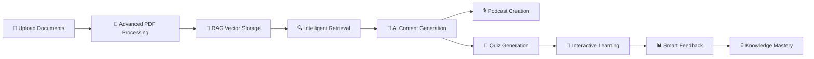

# 🧠✨ QuizGenius - AI-Powered Learning Revolution

<div align="center">


**Transform your content into engaging podcasts and interactive quizzes with RAG-powered AI! 🪄**

[](https://nextjs.org/)
[](https://reactjs.org/)
[](https://www.typescriptlang.org/)
[](https://python.org/)
[](https://fastapi.tiangolo.com/)
[](https://langchain.com/)
[](https://ai.google.dev/)

[🚀 Live Demo](#) • [📖 Documentation](#features) • [🎯 Features](#features) • [⚡ Quick Start](#quick-start) • [🧠 RAG System](#rag-system)

</div>

---

## 🌟 What is QuizGenius?

QuizGenius is a cutting-edge AI-powered platform that revolutionizes learning by transforming your documents and images into:
- 🎙️ **Interactive Learning Podcasts** from text and PDFs with AI narration
- 📝 **Smart Quizzes** from PDFs and images with OCR
- 🧠 **RAG-Powered Content Generation** with intelligent document search and retrieval
- 🔍 **Knowledge Base Management** with vector search capabilities
- 🎯 **Personalized Learning Experiences** with real-time feedback

### ✨ The Magic Behind It
Powered by **Google's Gemini 2.0 Flash** AI model, **LangChain RAG architecture**, **ChromaDB/FAISS vector stores**, and advanced PDF processing with Python, QuizGenius understands your content deeply. Our RAG system creates a searchable knowledge base from your documents, enabling:
- 📚 **Intelligent content retrieval** from your document collection
- 🎙️ **Context-aware podcast generation** from multiple sources
- 📝 **Comprehensive quiz creation** based on your entire knowledge base
- 🔗 **Source attribution** with document references

---

## 🎯 Features That Make Learning Fun

<table>
<tr>
<td align="center">

<br><br>
<b>RAG-Powered Intelligence</b><br>
Smart document retrieval with LangChain & vector databases for context-aware generation
</td>
<td align="center">

<br><br>
<b>AI Podcast Generation</b><br>
Transform text & PDFs into comprehensive 5-7 minute learning podcasts with natural AI narration
</td>
<td align="center">

<br><br>
<b>Smart Quiz Generation</b><br>
Create quizzes from your knowledge base with True/False, Multiple Choice & explanations
</td>
</tr>
<tr>
<td align="center">

<br><br>
<b>Advanced PDF Processing</b><br>
Multi-method Python extraction with OCR support & intelligent chunking for RAG storage
</td>
<td align="center">

<br><br>
<b>Intelligent Scoring</b><br>
Get detailed feedback, explanations & source references from your documents
</td>
<td align="center">

<br><br>
<b>Beautiful Dark Theme</b><br>
2-panel layouts, gradient cards, purple accents - stunning design
</td>
</tr>
</table>

---

## 🚀 Quick Start

### Prerequisites
- 📦 Node.js 18+ 
- 🐍 Python 3.9+ (for RAG system & advanced PDF processing)
- 🔑 Google Gemini API Key ([Get yours here](https://ai.google.dev/))

### 1️⃣ Clone & Install
```bash
git clone https://github.com/yourusername/quizgenius.git
cd quizgenius
npm install
```

### 2️⃣ Setup Environment
```bash
# Frontend environment
cp .env.example .env.local
echo "NEXT_PUBLIC_GEMINI_API_KEY=your_gemini_api_key_here" >> .env.local

# Backend environment (for RAG system)
cd backend
echo "GEMINI_API_KEY=your_gemini_api_key_here" > .env
```

### 3️⃣ Setup RAG System
```bash
# Install RAG dependencies
cd backend
pip install -r requirements-rag.txt

# Test RAG setup
python test_rag.py
```

### 4️⃣ Setup Basic PDF Processing 
```bash
# Install basic PDF processing dependencies
pip install -r scripts/requirements.txt

# Test the setup
python scripts/test_setup.py
```

### 5️⃣ Launch! 🚀
```bash
# Terminal 1: Start Frontend
npm run dev

# Terminal 2: Start RAG Backend (for advanced features)
cd backend
python start_rag_api.py
```

**Frontend:** [http://localhost:3000](http://localhost:3000) ✨  
**RAG API:** [http://localhost:8001](http://localhost:8001) 🧠

---

## 🛠️ Tech Stack

<div align="center">

| Frontend | Backend/RAG | AI/ML | Vector Storage |
|----------|-------------|--------|---------------|
|  |  |  |  |
|  |  |  |  |
|  |  |  |  |

| Styling | Document Processing | Development | Deployment |
|---------|-------------------|-------------|------------|
|  |  |  |  |
|  |  |  |  |

</div>

---

## 🎨 How It Works



### The RAG-Powered QuizGenius Process:
1. **📄 Document Ingestion**: Multi-method Python extraction (PyMuPDF, pdfplumber, OCR)
2. **🧠 Vector Storage**: Content chunked and stored in ChromaDB/FAISS with sentence embeddings
3. **🔍 Intelligent Retrieval**: LangChain-powered semantic search across your knowledge base
4. **🤖 Context-Aware Generation**: Gemini AI creates content from retrieved relevant passages
5. **🎙️ Enhanced Podcasts**: 5-7 minute comprehensive episodes from multiple source documents
6. **📝 Knowledge-Based Quizzes**: Questions generated from your entire document collection
7. **💬 Source-Referenced Feedback**: Explanations with direct references to source documents

### RAG System Architecture:
- **📚 Knowledge Base**: Your uploaded documents become a searchable vector database
- **🔍 Semantic Search**: Find relevant content using natural language queries
- **🧠 Context Synthesis**: AI combines information from multiple sources intelligently
- **📊 Source Attribution**: Every answer traces back to specific document sections

---

## 📁 Project Structure

```
quizgenius/
├── 🏠 app/                    # Next.js app directory
│   ├── 📄 layout.tsx         # Root layout with metadata
│   ├── 🏡 page.tsx           # Main page with RAG components
│   └── 🔗 api/               # Frontend API routes
│       ├── 📄 extract-pdf/   # Basic PDF processing
│       ├── 🎙️ generate-podcast/ # Enhanced podcast generation
│       └── 🔊 text-to-speech/ # Audio synthesis
├── 🧩 components/            # React components
│   ├── 🎭 ui/                # Base UI components (Shadcn)
│   ├── 🧠 rag-quiz-generator.tsx    # RAG-powered quiz generation
│   ├── 🎙️ rag-podcast-generator.tsx # RAG-powered podcast creation
│   ├── 📊 rag-integration-status.tsx # RAG system status
│   ├── 📝 quiz-generator-section.tsx # Legacy quiz generator
│   └── 🎨 *-section.tsx      # Other feature sections
├── 🧠 backend/               # RAG System (Python FastAPI)
│   ├── 🔧 rag/               # Core RAG modules
│   │   ├── 📊 vector_store.py      # ChromaDB/FAISS integration
│   │   ├── 🔍 retriever.py         # Semantic search logic
│   │   ├── 🤖 generator.py         # AI content generation
│   │   ├── 📄 document_processor.py # Document chunking
│   │   ├── 🎯 embeddings.py        # Sentence transformers
│   │   └── ⚙️ config.py            # RAG configuration
│   ├── 🌐 rag_api.py         # FastAPI backend server
│   ├── 📋 requirements-rag.txt # RAG system dependencies
│   ├── 🚀 start_rag_api.py   # Backend startup script
│   └── 📖 RAG_README.md      # RAG system documentation
├── 🐍 scripts/               # Legacy PDF processing
│   ├── 📄 pdf_text_extractor.py # Multi-method extraction
│   └── 🔧 requirements.txt   # Basic dependencies
├── 📚 lib/                   # Frontend utilities
│   ├── 🤖 gemini.ts          # Legacy AI integration
│   └── 🧠 rag-client.ts      # RAG API client
├── 🔧 .env.local             # Frontend environment
├── 🔧 backend/.env           # Backend environment (RAG)
└── 📖 README.md              # You are here! 👋
```

---

## 🧠 RAG System

QuizGenius features a sophisticated **Retrieval-Augmented Generation (RAG)** system that transforms how you interact with your documents:

### 🔧 Core Components

| Component | Technology | Purpose |
|-----------|------------|---------|
| **📊 Vector Store** | ChromaDB + FAISS Fallback | Efficient similarity search with automatic fallback |
| **🎯 Embeddings** | Sentence Transformers | High-quality semantic document representations |
| **🔍 Retrieval** | LangChain + Custom Logic | Intelligent content discovery from knowledge base |
| **🤖 Generation** | Gemini 2.0 Flash | Context-aware content creation with source attribution |
| **🌐 API** | FastAPI + Pydantic | High-performance backend with automatic docs |

### 🚀 Key Features

- **🔄 Automatic Fallback**: ChromaDB primary with FAISS fallback for maximum compatibility
- **📚 Multi-Document Support**: Build knowledge bases from multiple PDFs and text files
- **🔍 Semantic Search**: Find relevant content using natural language queries
- **📊 Source Attribution**: Every generated content references original source documents
- **⚡ Real-time Processing**: Instant document ingestion and query responses
- **🛡️ Robust Error Handling**: Graceful degradation and comprehensive logging

### 🎯 RAG-Powered Features

1. **🧠 Intelligent Quiz Generation**
   - Queries your entire knowledge base for comprehensive question coverage
   - Generates True/False, Multiple Choice questions with detailed explanations
   - References specific document sections for each question

2. **🎙️ Enhanced Podcast Creation**
   - Retrieves relevant content from multiple documents
   - Creates 5-7 minute comprehensive episodes
   - Expands limited content using AI knowledge and document context

3. **📊 Knowledge Base Management**
   - Upload and automatically process PDFs, text files, and documents
   - Smart chunking preserves context while enabling efficient search
   - Document management with source tracking and metadata

### 📈 Performance Optimizations

- **🔧 Smart Similarity Thresholds**: Adaptive thresholds for optimal content retrieval
- **📊 Efficient Chunking**: Optimized chunk sizes (1000 chars, 200 overlap) for context preservation
- **⚡ Caching**: Embedding cache reduces processing time for repeated content
- **🗂️ Metadata Enhancement**: Rich metadata tracking for better organization and filtering

---

## 🔒 Security Features

<div align="center">

| Security Feature | Status | Description |
|------------------|---------|-------------|
| 🔐 **API Key Protection** | ✅ Secure | Environment variables only |
| 🚫 **Git Ignore** | ✅ Active | Prevents accidental commits |
| 🛡️ **Runtime Validation** | ✅ Protected | Validates configuration |
| 🔍 **Error Handling** | ✅ Robust | Graceful failure management |

</div>

---

## 🎮 Usage Examples

### 🧠 RAG-Powered Quiz Generation
```typescript
// 1. Upload documents to build knowledge base
await ragClient.ingestFile(pdfFile, 'AI Research Paper');

// 2. Generate comprehensive quiz from knowledge base
const quiz = await ragClient.generateQuiz('machine learning concepts', {
  numberOfQuestions: 10,
  questionTypes: ['multiple-choice', 'true-false'],
  difficulty: 'medium'
});

// 3. Take quiz with source-referenced feedback! 🎯
```

### 🎙️ RAG-Enhanced Podcast Creation
```typescript
// 1. Query knowledge base for topic
const ragContent = await ragClient.query('AI in healthcare', {
  top_k: 8,
  include_sources: true
});

// 2. Generate comprehensive 5-7 minute podcast
const podcast = await generatePodcast(ragContent.answer, {
  style: 'educational',
  duration: '5-7 minutes',
  includeIntro: true
});
```

### 🔍 Knowledge Base Search
```typescript
// Semantic search across all documents
const results = await ragClient.query('What are neural networks?', {
  top_k: 5,
  similarity_threshold: 0.1,
  include_sources: true
});

// Get source-attributed answers
console.log(results.answer);     // Comprehensive response
console.log(results.sources);    // Source document references
```

---

## 🌈 Screenshots

<div align="center">

### 🏠 Beautiful Landing Page
*Coming Soon: Screenshots of the stunning dark theme interface*

### 📝 Quiz Interface
*Coming Soon: Interactive quiz generation and taking experience*

### 🎙️ Podcast Generation
*Coming Soon: Screenshots of AI-powered podcast creation with natural narration*

</div>

---

## 🤝 Contributing

We love contributions! Here's how you can help make QuizGenius even better:

1. 🍴 **Fork** the repository
2. 🌱 **Create** a feature branch: `git checkout -b feature/amazing-feature`
3. 💾 **Commit** your changes: `git commit -m 'Add amazing feature'`
4. 📤 **Push** to the branch: `git push origin feature/amazing-feature`
5. 🎉 **Open** a Pull Request

### 🎯 Areas for Contribution
- 🎨 UI/UX improvements
- 🤖 AI prompt optimization
- 📱 Mobile responsiveness
- 🌐 Internationalization
- 🧪 Testing coverage

---

## 📜 License

This project is licensed under the MIT License - see the [LICENSE](LICENSE) file for details.

---

## 🙏 Acknowledgments

- 🤖 **Google Gemini AI** - For powering our intelligent content generation and RAG responses
- 🧠 **LangChain** - For the robust RAG framework and document processing capabilities
- 📊 **ChromaDB & FAISS** - For efficient vector storage and similarity search
- 🎯 **Sentence Transformers** - For high-quality semantic embeddings
- 🌐 **FastAPI** - For the high-performance Python backend with automatic API docs
- 🐍 **Python Ecosystem** - PyMuPDF, pdfplumber, Tesseract OCR for robust document processing
- 🎙️ **Google Text-to-Speech** - For natural audio synthesis in podcast generation
- ⚛️ **React & Next.js** - For the amazing development experience and modern frontend
- 🎨 **Tailwind CSS** - For making beautiful, responsive styling effortless
- 🔧 **Radix UI & Shadcn/ui** - For accessible component primitives and beautiful design system

---

## 📞 Support & Contact

<div align="center">

**Need help? We're here for you!** 💖

[](https://github.com/yourusername/quizgenius/issues)
[](https://discord.gg/your-discord)
[](mailto:support@quizgenius.com)

</div>

---

<div align="center">

### 🌟 Star us on GitHub!

**If QuizGenius helped you learn better, give us a star! ⭐**

<!-- [⭐ **STAR THIS REPO** ⭐](https://github.com/yourusername/quizgenius) -->

---

**Made with ❤️ by developers who believe learning should be fun and accessible to everyone.**

🧠✨ **QuizGenius - Where AI meets Education!** ✨🧠

</div>