# 🧠✨ QuizGenius - AI-Powered Learning Revolution

<div align="center">


**Transform your content into engaging videos and interactive quizzes with AI magic! 🪄**

[](https://nextjs.org/)
[](https://reactjs.org/)
[](https://www.typescriptlang.org/)
[](https://tailwindcss.com/)
[](https://ai.google.dev/)

[🚀 Live Demo](#) • [📖 Documentation](#features) • [🎯 Features](#features) • [⚡ Quick Start](#quick-start)

</div>

---

## 🌟 What is QuizGenius?

QuizGenius is a cutting-edge AI-powered platform that revolutionizes learning by transforming your documents and images into:
- 🎬 **Interactive Learning Videos** from text and PDFs
- 📝 **Smart Quizzes** from PDFs and images
- 🎯 **Personalized Learning Experiences** with real-time feedback

### ✨ The Magic Behind It
Powered by **Google's Gemini 2.0 Flash** AI model, QuizGenius understands your content deeply and creates meaningful, context-aware questions that actually test comprehension - not just metadata!

---

## 🎯 Features That Make Learning Fun

<table>
<tr>
<td align="center">

<br><br>
<b>AI Video Generation</b><br>
Transform text & PDFs into engaging learning videos
</td>
<td align="center">

<br><br>
<b>Smart Quiz Generation</b><br>
Create quizzes from PDFs & images with OCR
</td>
<td align="center">

<br><br>
<b>Intelligent Scoring</b><br>
Get detailed feedback & explanations
</td>
</tr>
<tr>
<td align="center">

<br><br>
<b>Deep Content Analysis</b><br>
AI focuses on actual content, not metadata
</td>
<td align="center">

<br><br>
<b>Beautiful Dark Theme</b><br>
Easy on the eyes, stunning design
</td>
<td align="center">

<br><br>
<b>Mobile Responsive</b><br>
Perfect on any device
</td>
</tr>
</table>

---

## 🚀 Quick Start

### Prerequisites
- 📦 Node.js 18+ 
- 🔑 Google Gemini API Key ([Get yours here](https://ai.google.dev/))

### 1️⃣ Clone & Install
```bash
git clone https://github.com/yourusername/quizgenius.git
cd quizgenius
npm install
```

### 2️⃣ Setup Environment
```bash
# Create environment file
cp .env.example .env.local

# Add your API key to .env.local
NEXT_PUBLIC_GEMINI_API_KEY=your_gemini_api_key_here
```

### 3️⃣ Launch! 🚀
```bash
npm run dev
```

Open [http://localhost:3000](http://localhost:3000) and start creating! ✨

---

## 🛠️ Tech Stack

<div align="center">

| Frontend | AI/ML | Styling | Tools |
|----------|--------|---------|-------|
|  |  |  |  |
|  |  |  |  |

</div>

---

## 🎨 How It Works

```mermaid
graph LR
    A[📄 Upload Content] --> B[🤖 AI Analysis]
    B --> C[🎬 Video Generation]
    B --> D[📝 Quiz Creation]
    D --> E[🎯 Take Quiz]
    E --> F[📊 Smart Scoring]
    F --> G[💡 Learn & Improve]
```



### The QuizGenius Process:
1. **🔍 Smart Content Analysis**: AI reads and understands your documents
2. **🧠 Intelligent Processing**: Extracts meaningful information, ignores metadata
3. **🎯 Context-Aware Generation**: Creates relevant questions about actual content
4. **💬 Detailed Feedback**: Provides explanations and references to source material

---

## 📁 Project Structure

```
quizgenius/
├── 🏠 app/                    # Next.js app directory
│   ├── 📄 layout.tsx         # Root layout with metadata
│   └── 🏡 page.tsx           # Main page composition
├── 🧩 components/            # Reusable React components
│   ├── 🎭 ui/                # Base UI components
│   ├── 🎬 video-generator-section.tsx
│   ├── 📝 quiz-generator-section.tsx
│   └── 🎨 *-section.tsx      # Feature sections
├── 📚 lib/                   # Utility libraries
│   └── 🤖 gemini.ts          # AI integration
├── 🔧 .env.local             # Environment variables (private)
└── 📖 README.md              # You are here! 👋
```

---

## 🔒 Security Features

<div align="center">

| Security Feature | Status | Description |
|------------------|---------|-------------|
| 🔐 **API Key Protection** | ✅ Secure | Environment variables only |
| 🚫 **Git Ignore** | ✅ Active | Prevents accidental commits |
| 🛡️ **Runtime Validation** | ✅ Protected | Validates configuration |
| 🔍 **Error Handling** | ✅ Robust | Graceful failure management |

</div>

---

## 🎮 Usage Examples

### 📝 Creating a Quiz
```typescript
// Upload a PDF or image
const quiz = await generateQuiz(file, {
  numberOfQuestions: 5,
  difficulty: 'medium',
  questionTypes: ['multiple-choice', 'true-false']
});

// Take the quiz and get instant feedback! 🎯
```

### 🎬 Generating Videos
```typescript
// From text or PDF content
const video = await generateLearningVideo(content, {
  style: 'educational',
  duration: 'auto'
});
```

---

## 🌈 Screenshots

<div align="center">

### 🏠 Beautiful Landing Page
*Coming Soon: Screenshots of the stunning dark theme interface*

### 📝 Quiz Interface
*Coming Soon: Interactive quiz generation and taking experience*

### 🎬 Video Generation
*Coming Soon: AI-powered video creation from your content*

</div>

---

## 🤝 Contributing

We love contributions! Here's how you can help make QuizGenius even better:

1. 🍴 **Fork** the repository
2. 🌱 **Create** a feature branch: `git checkout -b feature/amazing-feature`
3. 💾 **Commit** your changes: `git commit -m 'Add amazing feature'`
4. 📤 **Push** to the branch: `git push origin feature/amazing-feature`
5. 🎉 **Open** a Pull Request

### 🎯 Areas for Contribution
- 🎨 UI/UX improvements
- 🤖 AI prompt optimization
- 📱 Mobile responsiveness
- 🌐 Internationalization
- 🧪 Testing coverage

---

## 📜 License

This project is licensed under the MIT License - see the [LICENSE](LICENSE) file for details.

---

## 🙏 Acknowledgments

- 🤖 **Google Gemini AI** - For powering our intelligent quiz generation
- ⚛️ **React & Next.js** - For the amazing development experience
- 🎨 **Tailwind CSS** - For making styling a breeze
- 🔧 **Radix UI** - For accessible component primitives

---

## 📞 Support & Contact

<div align="center">

**Need help? We're here for you!** 💖

[](https://github.com/yourusername/quizgenius/issues)
[](https://discord.gg/your-discord)
[](mailto:support@quizgenius.com)

</div>

---

<div align="center">

### 🌟 Star us on GitHub!

**If QuizGenius helped you learn better, give us a star! ⭐**

[⭐ **STAR THIS REPO** ⭐](https://github.com/yourusername/quizgenius)

---

**Made with ❤️ by developers who believe learning should be fun and accessible to everyone.**

🧠✨ **QuizGenius - Where AI meets Education!** ✨🧠

</div>